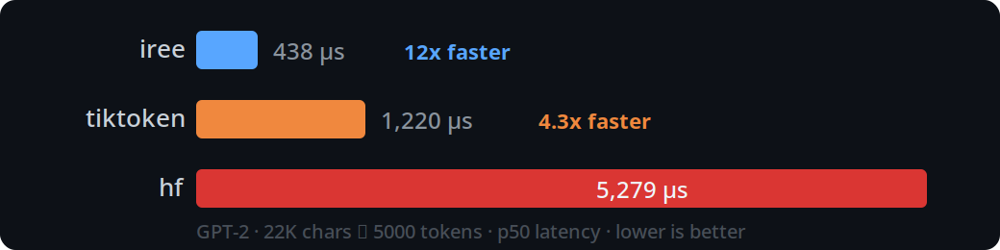
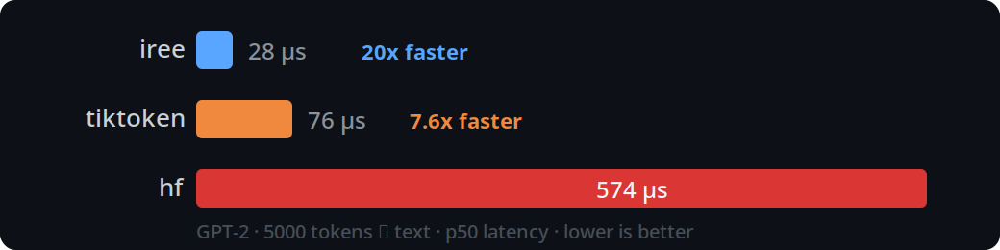
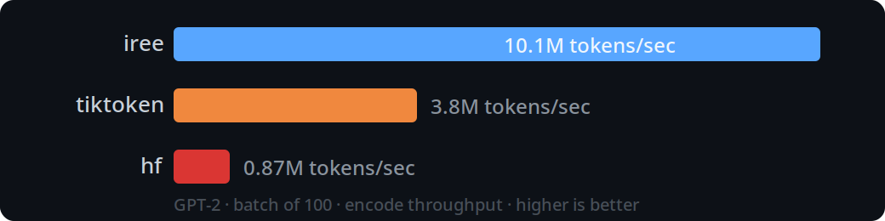

# iree-tokenizer

Python bindings for the [IREE](https://github.com/iree-org/iree) tokenizer —
a high-performance C tokenizer with full HuggingFace `tokenizer.json`
compatibility.

- **Fast.** 3–12x faster than tiktoken, 10–20x faster than HF tokenizers.
  Pure C hot path with zero allocations per token.
- **Zero Python dependencies** beyond numpy.
- **Small.** ~317KiB (compared to 1-3MiB for alternatives).
- **Streaming encode/decode.** First-class support for incremental
  tokenization — feed chunks in, get tokens out. Ideal for LLM inference.
- **Drop-in compatible.** Loads any HuggingFace `tokenizer.json`. Supports
  BPE, WordPiece, and Unigram models.

Based on the IREE high-speed tokenizer library:

- **Optimized for cache utilization.** Efficiently utilizes cache on both large and small CPUs. No dependencies and small footprint make it ideal for embedded/client and inclusion into other projects.
- **Unique Algorithmic optimizations.** Pull-based streaming processor with bounded/small, deterministic memory usage. Various novel optimizations not seen elsewhere.
- **GPU-ready.** Designed to be compatible with executing tiled on the GPU,
  not just the host.

## Performance

### Encode



Single-string encode of 22K characters into 5000 tokens. IREE completes in
438 µs — 2.8x faster than tiktoken's Rust backend and 12x faster than
HuggingFace tokenizers.

### Decode



Decoding 5000 tokens back to text. IREE finishes in 28 µs — 2.7x faster
than tiktoken and 20x faster than HuggingFace.

### Batch Encode Throughput



Encoding 100 paragraphs in a single batch call using shared internal state.
IREE sustains 10M tokens/sec with linear scaling across batch sizes.

Measured on an AMD Threadripper 3970X (32C/64T), 128 GB DDR4, Fedora 43,
GCC 15.2, Python 3.14. Single-threaded, p50 latency over 50 iterations.
GPT-2 tokenizer (`openai-community/gpt2`).

Run benchmarks yourself:
```
pip install tokenizers tiktoken rich huggingface-hub
python benchmarks/bench_comparison.py
```

## Install

```bash
git clone https://github.com/iree-org/iree.git /path/to/iree
IREE_SOURCE_DIR=/path/to/iree pip install .
```

## Quick Start

```python
from iree.tokenizer import Tokenizer

tok = Tokenizer.from_file("tokenizer.json")

# Encode / decode
ids = tok.encode("Hello world")          # [15496, 995]
text = tok.decode(ids)                    # "Hello world"

# Batch
tok.encode_batch(["Hello", "world"])      # [[15496], [995]]

# Numpy (zero-copy)
arr = tok.encode_to_array("Hello world")  # int32 ndarray

# Rich encoding with byte offsets
enc = tok.encode_rich("Hello world", track_offsets=True)
# enc.ids, enc.offsets, enc.type_ids

# Streaming decode (LLM token-at-a-time pattern)
from iree.tokenizer import decode_stream_iter
for chunk in decode_stream_iter(tok, token_generator):
    print(chunk, end="", flush=True)
```

## API

| Method | Returns | Description |
|--------|---------|-------------|
| `Tokenizer.from_file(path)` | `Tokenizer` | Load from `tokenizer.json` |
| `Tokenizer.from_str(json)` | `Tokenizer` | Load from JSON string |
| `Tokenizer.from_buffer(bytes)` | `Tokenizer` | Load from bytes |
| `tok.encode(text)` | `list[int]` | Encode text to token IDs |
| `tok.encode_to_array(text)` | `np.ndarray` | Encode to numpy int32 array |
| `tok.encode_rich(text)` | `Encoding` | IDs + byte offsets + type IDs |
| `tok.decode(ids)` | `str` | Decode token IDs to text |
| `tok.encode_batch(texts)` | `list[list[int]]` | Batch encode |
| `tok.decode_batch(id_lists)` | `list[str]` | Batch decode |
| `tok.encode_stream()` | `EncodeStream` | Streaming encoder (context manager) |
| `tok.decode_stream()` | `DecodeStream` | Streaming decoder (context manager) |
| `tok.vocab_size` | `int` | Vocabulary size |
| `tok.model_type` | `str` | `"BPE"`, `"WordPiece"`, or `"Unigram"` |
| `tok.token_to_id(token)` | `int \| None` | Look up token ID |
| `tok.id_to_token(id)` | `str \| None` | Look up token text |

## Development

```bash
# Build
cmake -B build -G Ninja -DIREE_SOURCE_DIR=/path/to/iree
cmake --build build

# Test
ln -s build/_iree_tokenizer*.so src/iree/tokenizer/
PYTHONPATH=src pytest tests/ -v

# ASAN (requires Clang)
cmake -B build-asan -G Ninja \
  -DIREE_SOURCE_DIR=/path/to/iree \
  -DCMAKE_BUILD_TYPE=Debug \
  -DCMAKE_C_COMPILER=clang -DCMAKE_CXX_COMPILER=clang++ \
  -DIREE_TOKENIZER_ENABLE_ASAN=ON
cmake --build build-asan
ln -sf build-asan/_iree_tokenizer*.so src/iree/tokenizer/
LD_PRELOAD=$(clang++ -print-file-name=libclang_rt.asan.so) \
  ASAN_OPTIONS=detect_leaks=0 PYTHONPATH=src pytest tests/ -v

# Optimized local build (-march=native)
IREE_TOKENIZER_NATIVE_ARCH=ON pip install .
```

## License

Apache 2.0 with LLVM Exceptions — see [LICENSE](LICENSE).
